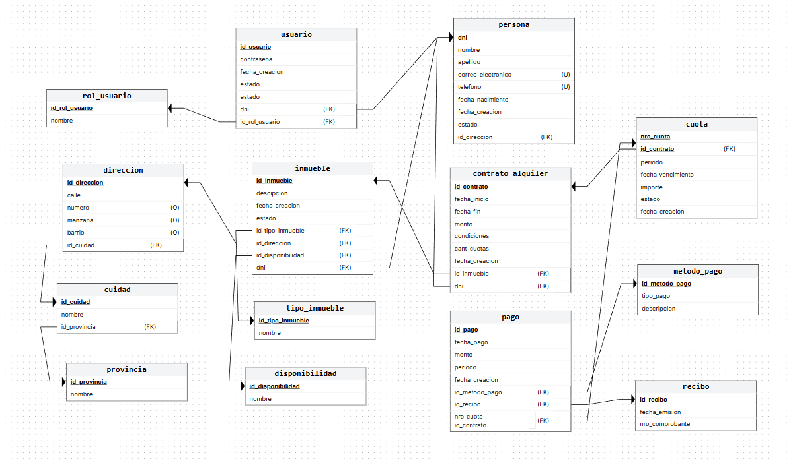

# Proyecto de Estudio!

*Estructura del documento principal:*

# PRESENTACIÓN (Sistema de  Gestión de Alquileres “Alquiler  Pro”)

*Universidad*: Universidad Nacional del Nordeste  
*Facultad*: Facultad de Ciencias Exactas y Naturales y Agrimensura  
*Carrera*: Licenciatura en Sistemas de Información  
*Asignatura*: Base de Datos I  
*Año Lectivo*: 2025

*Sistema*: Sistema de  Gestión de Alquileres “Alquiler  Pro”

*Grupo N°*: 23

*Integrantes*:
 - Gauto Ivan Guillermo
 - Garavaglia Miguel Gustavo
 - Quintana Fabian Gustavo
 - Romero Maurin Ivan

---

## CAPÍTULO I: INTRODUCCIÓN

### Caso de estudio

**Tema — Automatización de la Gestión de Alquileres, Contratos y Pagos en Empresas Inmobiliarias**

En el ámbito inmobiliario, el alquiler de propiedades es uno de los procesos más frecuentes y al mismo tiempo más complejos de gestionar. No solo implica el registro de inmuebles disponibles y ocupados, sino también el seguimiento de contratos, cuotas, clientes, pagos y métodos de pago.

Este trabajo se centra en el diseño de una **base de datos** para un sistema llamado **“Alquiler Pro”** orientado a digitalizar y automatizar la información necesaria para gestionar de manera eficiente todo el ciclo de vida de un contrato de alquiler.

### Definición o planteamiento del problema

La gestión tradicional de alquileres en empresas inmobiliarias pequeñas o medianas que no cuentan con un sistema automatizado suele presentar múltiples dificultades que impactan directamente en la eficiencia y en la relación con los clientes. El uso de planillas de Excel sueltas, carpetas físicas o registros dispersos genera procesos manuales lentos e ineficientes en tareas repetitivas como registrar pagos, verificar deudas o generar recibos. A esto se suman los errores frecuentes en los datos, como la duplicación de clientes, inconsistencias en teléfonos o correos, la omisión de pagos o contratos vencidos sin el debido seguimiento.

La falta de control también es un problema habitual, ya que se pierde visibilidad sobre el estado de los inmuebles (si están disponibles, alquilados o en reparación) y resulta difícil relacionar cada propiedad con su propietario, inquilino y contrato vigente. Asimismo, el control de pagos se ve afectado, con complicaciones para controlar cuotas vencidas/pagadas y dificultades para emitir comprobantes claros y confiables.

En resumen, la ausencia de un sistema unificado y confiable genera costos adicionales en tiempo, reduce la productividad de los empleados y debilita la relación con los clientes, ya que no se les puede brindar información rápida y precisa sobre sus contratos o pagos. Frente a esto surge la necesidad de desarrollar una **base de datos** para un sistema informático que integre todas las áreas críticas (clientes, inmuebles, contratos, cuotas y pagos) para garantizar una gestión ordenada, segura y eficiente.

### Objetivo del Trabajo Práctico

El propósito de este trabajo es **diseñar y documentar una base de datos** que funcione como el núcleo del sistema “Alquiler Pro”, asegurando la correcta representación de los procesos de negocio de una empresa inmobiliaria y sentando las bases para un sistema robusto de gestión de alquileres.

### Preguntas Generales

- ¿Cómo podemos automatizar y optimizar la gestión de alquileres teniendo en cuenta el registro de inquilinos, inmuebles, contratos y llevar un control sobre los pagos de cada contrato?

### Preguntas Específicas

- ¿Cómo diseñar un modelo de base de datos que garantice la integridad de los datos en un sistema de alquileres?
- ¿De qué manera se puede controlar la disponibilidad de un inmueble y evitar que se alquile dos veces en paralelo?
- ¿Qué estructura permite vincular de forma eficiente a clientes con distintos roles (propietario e inquilino)?
- ¿Cómo asegurar la trazabilidad de pagos, desde la generación de cuotas hasta la emisión de recibos?

### Objetivos Generales

Implementar un modelo de base de datos que permita **automatizar y optimizar** la gestión de contratos de alquiler, inmuebles, clientes y pagos, **garantizando la integridad** de la información y reduciendo la posibilidad de errores.

### Objetivos Específicos

- Administrar **contratos de alquiler** detallando fecha de inicio, vencimiento, condiciones, monto y cuotas correspondientes.
- Registrar **pagos** asociados a cuotas y contratos, vinculando cada transacción con un **método de pago** y un **recibo**.
- Emitir **comprobantes y recibos** que respalden las operaciones, garantizando la **trazabilidad** de los pagos.
- Registrar de manera **centralizada** la información de **clientes** (propietarios, inquilinos y usuarios del sistema), evitando duplicados y asegurando datos de contacto válidos.

### Descripción del Sistema

El sistema está diseñado para **empresas inmobiliarias** que administran inmuebles en la provincia de Corrientes, con la posibilidad de gestionar propiedades tanto en la capital como en localidades del interior. Su propósito es brindar una solución integral para registrar, organizar y controlar toda la información relacionada con **clientes, inmuebles, contratos de alquiler, pagos y cuotas**, centralizando los datos y eliminando la dependencia de procesos manuales.

**Módulos principales:**
- **Gestión de clientes y roles:** registro de personas y asignación de roles específicos (propietarios, inquilinos o usuarios internos).
- **Gestión de inmuebles:** administración del inventario de propiedades; estado, disponibilidad y ubicación (provincia, ciudad, dirección).
- **Contratos de alquiler:** registro y gestión de contratos vigentes; fechas, condiciones, cuotas e inmuebles asociados.
- **Pagos y recibos:** registro de pagos de cuotas; métodos de pago y generación de comprobantes.
- **Gestión de usuarios y seguridad:** perfiles de acceso y permisos.

**Roles principales:**
- **Administrador del sistema:** mantenimiento general, seguridad de datos y creación de usuarios.
- **Gerente inmobiliario:** administración completa de clientes, contratos, inmuebles e informes.
- **Operador/administrativo:** registro diario de contratos, pagos y emisión de recibos.

Gracias a esta estructura modular, cada perfil trabaja sobre la información que necesita, asegurando **eficiencia** y **minimizando errores**.

### Alcance

El alcance del presente análisis se centra en la **gestión centralizada de los procesos de alquileres**. Específicamente, se abordan:

- Gestión de **usuarios y roles** (administrador, gerente, operador).
- Gestión de **clientes y roles** (propietario, inquilino).
- Administración de **inmuebles** (ubicación, tipo y estado de disponibilidad).
- **Creación y control** de contratos de alquiler.
- **Generación de cuotas** asociadas a contratos.
- **Registro de pagos** realizados por los inquilinos, vinculados a recibos y métodos de pago.

**No se consideran** dentro del alcance:
- Conexión con **organismos fiscales** o sistemas externos de **facturación electrónica**.
- Funcionalidades avanzadas de **análisis de mercado** o **predicción de demanda**.
- **Gestión jurídica y legalidad** de un contrato real (la validez legal corresponde a un escribano/profesional habilitado).

> En el contexto del sistema, se utiliza el término **“contrato”** para referirse a la **relación** que se establece en la base de datos entre el **inquilino**, el **inmueble** y el **propietario**, junto con las condiciones y cuotas acordadas.

---

## CAPITULO II: MARCO CONCEPTUAL O REFERENCIAL

# Procedimientos Almacenados

Los procedimientos almacenados son bloques de instrucciones SQL predefinidos que se guardan y ejecutan directamente en el motor de base de datos. Su finalidad principal es automatizar operaciones complejas o repetitivas, como inserciones, actualizaciones, eliminaciones o consultas, concentrando la lógica de negocio dentro del servidor. Al ejecutarse en el propio sistema gestor, estos procedimientos acceden de manera directa a los datos, lo que permite reducir significativamente el tráfico de información entre el cliente y el servidor y mejorar el rendimiento general del sistema. Este tipo de rutinas resulta especialmente útil en entornos donde varias aplicaciones interactúan con una misma base de datos, ya que garantiza la coherencia de los procesos y simplifica las tareas de mantenimiento. Además, posibilita la implementación de políticas de seguridad más estrictas, dado que los usuarios pueden ejecutar un procedimiento sin acceder directamente a las tablas subyacentes, evitando así modificaciones no autorizadas en la información almacenada.

### Creación y administración

La definición de un procedimiento almacenado se realiza mediante la sentencia `CREATE PROCEDURE`, la cual permite incluir parámetros de entrada, de salida o de ambos tipos, dependiendo de las necesidades del proceso. Posteriormente, puede modificarse con la instrucción `ALTER PROCEDURE` o eliminarse con `DROP PROCEDURE`. En su interior, un procedimiento puede contener instrucciones SQL de manipulación de datos, estructuras de control condicionales o iterativas, validaciones lógicas e incluso llamadas a otros procedimientos. Esta flexibilidad hace posible desarrollar procesos complejos de forma estructurada y centralizada dentro de la base de datos.

### Características principales

Los procedimientos almacenados son capaces de ejecutar operaciones de manipulación de datos (CRUD) y también de manejar transacciones completas, lo que asegura la integridad de las operaciones cuando involucran múltiples tablas. Además, pueden devolver valores de estado o mensajes personalizados, e invocar a otros procedimientos, lo que contribuye a la modularidad y reutilización del código. Al ejecutarse directamente en el servidor, se elimina la sobrecarga de múltiples comunicaciones con el cliente, y su plan de ejecución puede precompilarse y almacenarse en caché, mejorando la velocidad de respuesta y el rendimiento en consultas repetitivas o de alta demanda.

### Tipos de procedimientos almacenados

Los procedimientos almacenados pueden clasificarse en distintos tipos según su propósito y alcance. Los **definidos por el usuario** son creados manualmente por los desarrolladores para tareas específicas dentro de una base de datos determinada. Los **procedimientos temporales** existen únicamente durante la sesión actual y se almacenan en bases de datos temporales; se eliminan automáticamente al cerrar la conexión. Los **procedimientos del sistema** son aquellos que proporciona el propio motor de base de datos y se utilizan para la administración, el mantenimiento o la programación de tareas internas. Finalmente, los **procedimientos extendidos** están escritos en otros lenguajes de programación, como C o .NET, y se ejecutan desde el servidor para extender las funcionalidades del sistema gestor.

### Ventajas

El uso de procedimientos almacenados ofrece numerosas ventajas dentro del entorno de gestión de bases de datos. En primer lugar, proporcionan un **rendimiento superior**, ya que la ejecución ocurre internamente en el servidor y se reutilizan planes de ejecución precompilados. Además, incrementan la **seguridad** al permitir que los usuarios ejecuten operaciones específicas sin necesidad de acceder directamente a las tablas, lo que protege los datos sensibles y evita modificaciones indebidas. También reducen el **tráfico de red**, ya que solo se transmiten los resultados finales al cliente, y facilitan el **mantenimiento del sistema**, puesto que cualquier modificación en la lógica de negocio se realiza directamente en el procedimiento sin afectar al código de las aplicaciones cliente.

> En **SQL Server**, los procedimientos pueden desarrollarse tanto en Transact-SQL (T-SQL) como mediante el Common Language Runtime (CLR) de .NET. Este motor ofrece la ventaja de compilar automáticamente las rutinas y almacenar los planes de ejecución en caché para optimizar su rendimiento. Asimismo, SQL Server incluye procedimientos del sistema, identificados con prefijos como `sp_` o `xp_`, los cuales cumplen funciones administrativas, de diagnóstico y configuración, ampliando las posibilidades de control y automatización dentro del servidor.

---

## Funciones Almacenadas

Las funciones almacenadas son rutinas definidas por el usuario que se guardan dentro de la base de datos y están orientadas a devolver un único valor o un conjunto de resultados. Estas funciones se utilizan principalmente para realizar cálculos, validaciones o transformaciones de datos que pueden ser reutilizadas en diferentes consultas SQL. A diferencia de los procedimientos almacenados, las funciones no están diseñadas para modificar los datos directamente, sino para procesarlos y retornar un resultado específico que puede integrarse dentro de otras instrucciones SQL. Esto las convierte en herramientas esenciales para mantener la consistencia de los cálculos y la coherencia de las reglas de negocio dentro del sistema.

### Creación y administración

La creación de una función almacenada se lleva a cabo mediante la sentencia `CREATE FUNCTION`, en la cual se definen los parámetros de entrada y el tipo de valor que retornará. Al igual que los procedimientos, una función puede modificarse mediante la instrucción `ALTER FUNCTION` o eliminarse con `DROP FUNCTION`. El cuerpo de la función suele incluir expresiones de cálculo, consultas internas y condiciones lógicas, pero no puede contener instrucciones de modificación directa sobre las tablas, como `INSERT`, `UPDATE` o `DELETE`. Esto garantiza que las funciones sean estructuras puramente declarativas, centradas en el análisis o procesamiento de datos, y que su ejecución no afecte la integridad de la información almacenada.

### Características principales

Las funciones almacenadas se caracterizan por tener un valor de retorno obligatorio, que puede ser escalar (como un número, una cadena o una fecha) o un conjunto de resultados en forma de tabla. Esta propiedad las diferencia claramente de los procedimientos almacenados, que pueden o no devolver un resultado. Además, las funciones no están autorizadas a modificar los datos directamente, lo que asegura que sus resultados sean consistentes y deterministas. Su principal fortaleza radica en que pueden emplearse dentro de distintas partes de una consulta SQL, como las cláusulas `SELECT`, `WHERE`, `GROUP BY` o `ORDER BY`, actuando como expresiones reutilizables que simplifican y estandarizan la lógica de procesamiento de datos. Asimismo, su diseño modular permite aplicar la misma lógica en diferentes contextos, reduciendo la redundancia del código y garantizando la coherencia de los resultados.

### Tipos de funciones almacenadas

Existen principalmente dos tipos de funciones almacenadas según el valor que devuelven. Las **funciones escalares** retornan un único valor y suelen utilizarse para cálculos, conversiones o validaciones específicas, como determinar un total, calcular impuestos o formatear datos. Por otro lado, las **funciones con valor de tabla** devuelven un conjunto de filas y columnas, comportándose como una tabla virtual que puede integrarse dentro de una consulta SQL. Este tipo de funciones es especialmente útil para generar resultados dinámicos o vistas lógicas derivadas de procesos de filtrado o agregación.

### Ventajas

Las funciones almacenadas presentan diversas ventajas que contribuyen a la eficiencia y organización de las bases de datos. En primer lugar, promueven la **reutilización del código**, ya que permiten centralizar cálculos o fórmulas recurrentes en una única definición accesible desde cualquier consulta. Además, facilitan la **estandarización de las reglas de negocio**, garantizando resultados uniformes ante los mismos parámetros de entrada. Su ejecución dentro del servidor mejora el **rendimiento**, al disminuir el intercambio de datos con las aplicaciones cliente, y su uso refuerza la **seguridad y la abstracción** de la base de datos, al ocultar la estructura interna de las tablas y exponer únicamente la información necesaria. En conjunto, las funciones almacenadas fortalecen la consistencia lógica y la mantenibilidad del sistema.

> En **SQL Server**, las funciones pueden ser de tipo escalar o con valor de tabla, y se utilizan con frecuencia para generar columnas calculadas, aplicar reglas de validación o realizar transformaciones de datos en consultas complejas. Al igual que los procedimientos, aprovechan la compilación previa y la reutilización de planes de ejecución, lo que permite un procesamiento más rápido, modular y estable dentro del servidor.

---
* Tema 2: ---
### TEMA 3: Manejo de Transacciones

### Definición de Transacción
Una transacción se define como una unidad única de trabajo. En la práctica, se utiliza para agrupar múltiples operaciones (como INSERT o UPDATE) que deben ocurrir juntas para que los datos mantengan su sentido.

Si la transacción tiene éxito, todas las modificaciones de datos se confirman (COMMIT) y se convierten en una parte permanente de la base de datos.
Si la transacción encuentra errores o debe cancelarse, todas las modificaciones se borran (revierten o ROLLBACK).

### Las Propiedades ACID
Las transacciones se rigen por cuatro propiedades críticas (ACID) que garantizan la integridad de los datos:

Atomicidad (Atomicity): Es el principio de "todo o nada". La transacción se trata como una unidad indivisible: o se completan todas las operaciones que la componen, o no se completa ninguna (se revierten todos los cambios).

Consistencia (Consistency): Asegura que la base de datos solo puede pasar de un estado válido a otro estado válido. La transacción debe respetar todas las reglas y restricciones (constraints). Si una transacción viola alguna regla, se revierte para mantener la consistencia.

Aislamiento (Isolation): Garantiza que las operaciones de una transacción no interfieran con las de otras transacciones que se ejecutan al mismo tiempo (concurrentes).

Durabilidad (Durability): Una vez que una transacción ha sido confirmada (COMMIT), sus cambios son permanentes y deben sobrevivir a cualquier fallo posterior del sistema (como un corte de energía).

### Comandos de Control Básico
BEGIN TRANSACTION: Marca el punto de inicio de una transacción. Todas las operaciones siguientes son consideradas parte de una única unidad de trabajo.

COMMIT: Se usa para finalizar con éxito la transacción. Indica que todas las operaciones fueron correctas y los cambios deben hacerse permanentes (cumpliendo la Durabilidad).

ROLLBACK: Se usa para cancelar la transacción, usualmente tras un error. Revierte todos los cambios realizados desde el BEGIN TRANSACTION, devolviendo la base de datos a su estado original (cumpliendo la Atomicidad).

### Savepoints (Puntos de Guardado)
Este concepto es la solución estándar de SQL para la necesidad de rollbacks parciales.

Un SAVEPOINT (o SAVE TRANSACTION en T-SQL) es un marcador o "punto de control" que se coloca dentro de una transacción.

Si ocurre un error, en lugar de un ROLLBACK total, se puede ejecutar un ROLLBACK TO SAVEPOINT.

Esto no finaliza la transacción; solo deshace las operaciones ocurridas después del savepoint. La transacción principal sigue activa, conservando los cambios anteriores al savepoint, y debe finalizar con un COMMIT o ROLLBACK total.

### El "Anidamiento Aplanado" de SQL Server (@@TRANCOUNT)
SQL Server presenta una implementación particular que puede ser engañosa y se conoce como "transacción aplanada".

En lugar de crear sub-transacciones reales, SQL Server utiliza un contador global: @@TRANCOUNT.

Un BEGIN TRAN simplemente incrementa @@TRANCOUNT en 1.

Un COMMIT TRAN simplemente decrementa @@TRANCOUNT en 1. La confirmación (COMMIT) real no ocurre hasta que el contador llega a 0.

Punto Crítico: Un comando ROLLBACK TRAN (sin un nombre de savepoint) ignora el contador y resetea @@TRANCOUNT a 0 de inmediato. Esto significa que un ROLLBACK en un nivel "interno" deshace la transacción completa, incluyendo todo el trabajo hecho por los niveles "externos".

* Tema 4: ---

## CAPÍTULO III: METODOLOGÍA SEGUIDA

## Etapas del Proyecto

* **Fase de Definición del Caso de Estudio:** Para seleccionar la temática a utilizar, decidimos seguir con nuestro proyecto de gestión de alquileres que veníamos realizando desde ingeniería de software I, ya que teníamos la especificación de requisitos y entrevistas ya hechas de ese tema.
* **Fase del Modelado Conceptual:** En esta etapa, mantuvimos diversos encuentros para construir el esquema conceptual de la futura base de datos. Utilizamos un método de tormenta de ideas para incorporar entidades al diagrama. Posteriormente, el grupo debatió la coherencia de cada elemento añadido y su interrelación con las demás entidades, conservando únicamente las más relevantes.
* **Fase del Diseño del Modelo Entidad-Relación (ER):** Con la conceptualización de la base de datos definida, iniciamos el diseño de un diagrama ER, donde especificamos cada entidad y sus correspondientes relaciones. En este proceso colaboró todo el equipo para considerar la totalidad de opiniones y perspectivas, buscando un resultado fidedigno y alineado con nuestros objetivos.
* **Fase de Implementación:** Esta etapa agrupa todas las fases de trabajo individual de los miembros, centradas en el tema asignado a cada uno.
* **Fase de Puesta en Común:** Una vez finalizados los scripts, coordinamos un encuentro para que cada miembro presente su tema. Esta exposición incluyó el método de desarrollo del script, los aspectos clave de su tópico y cualquier información pertinente que deseara compartir. Esto se realizó con el objetivo de que todo el equipo tuviera conocimiento integral de los temas tratados en el proyecto.
* **Fase de Cierre:** Para esta etapa final, todo el equipo se reunió para revisar exhaustivamente el repositorio completo, incluyendo la documentación y el código. El objetivo fue subsanar cualquier omisión o error que pudiera haber pasado inadvertido.

## Recursos Tecnológicos

Para la realización de este proyecto de estudio, se emplearon los siguientes recursos tecnológicos:

* **ERD Plus:** Una herramienta de modelado de bases de datos simple y potente, que ofrece utilidades para crear diagramas relacionales, conceptuales y código SQL. ERD Plus fue utilizado para modelar el esquema conceptual.
* **SQL Server Management Studio 20:** Un entorno de gestión y administración de bases de datos de Microsoft, diseñado específicamente para operar con SQL Server, entre otros lenguajes.
* **Sintaxis de escritura y formato básicos de Github:** La documentación oficial de Github destinada a crear formatos de texto enriquecidos mediante sintaxis simple. Se utilizó para la redacción de la documentación.

## CAPÍTULO IV: DESARROLLO DEL TEMA
En este capítulo se presentan en detalle los datos e información que se recopilaron y organizaron para el diseño del sistema **Alquiler Pro**, cuyo objetivo es optimizar la gestión de inmuebles, contratos, clientes y pagos en una empresa inmobiliaria.  
Se emplearon diversas herramientas y metodologías para lograr el diseño y la administración de la base de datos. Entre ellas, se destacan los **Diagramas Entidad–Relación (DER)**, que permitieron representar de manera gráfica y clara las entidades, atributos y relaciones que conforman el sistema. Gracias a esta representación visual, fue posible identificar la estructura de los datos, su comportamiento y las restricciones de integridad necesarias para asegurar la consistencia de la información.

### Diagrama de Modelo Relacional
El **Diagrama de Modelo Relacional**, también conocido como Diagrama Entidad–Relación (ER), es una representación gráfica que muestra la estructura lógica de la base de datos, destacando las entidades que la componen, sus atributos principales y las relaciones que existen entre ellas.  
A continuación, se presenta el **Modelo Relacional del sistema Alquiler Pro**, el cual refleja las entidades definidas y sus interrelaciones en el dominio de la gestión de alquileres.

Desarrollo TEMA 1 "Procedimientos y funciones almacenadas"

> Acceder a la siguiente carpeta para la descripción completa del tema [scripts-> Tema01_procedimientos_funciones_almacenadas](scripts/Tema01_procedimientos_funciones_almacenadas/tema01_procedimientos_funciones_almacenadas.md)

Desarrollo TEMA 2 "Optimización de consultas a través de índices"

> Acceder a la siguiente carpeta para la descripción completa del tema [scripts-> tema02_optimización_de_consultas_a_través_de_índices](scripts/tema02_optimización_de_consultas_a_través_de_índices/tema02_optimizacion_indices.md)

Desarrollo TEMA 3 "Manejo de Transacciones"

> Acceder a la siguiente carpeta para la descripción completa del tema [scripts-> tema03_transacciones](scripts/tema03_transacciones/tema03_transacciones.md)

Desarrollo TEMA 4 "Triggers (Disparadores)"

> Acceder a la siguiente carpeta para la descripción completa del tema [scripts-> tema04_triggers](scripts/tema04_triggers/tema04_triggers.md)

## CAPÍTULO V: CONCLUSIONES

...

## BIBLIOGRAFÍA DE CONSULTA

 Gray, J., & Reuter, A. (1993). *Transaction Processing: Concepts and Techniques*. Morgan Kaufmann.

Silberschatz, A., Korth, H. F., & Sudarshan, S. *Database System Concepts*. McGraw-Hill.

### Documentación Oficial de Motores SQL

#### Microsoft (SQL Server / T-SQL)

[@@TRANCOUNT (Transact-SQL)](https://learn.microsoft.com/es-es/sql/t-sql/functions/trancount-transact-sql)

[BEGIN TRANSACTION (Transact-SQL)](https://learn.microsoft.com/es-es/sql/t-sql/language-elements/begin-transaction-transact-sql)

[COMMIT TRANSACTION (Transact-SQL)](https://learn.microsoft.com/es-es/sql/t-sql/language-elements/commit-transaction-transact-sql)

[ROLLBACK TRANSACTION (Transact-SQL)](https://learn.microsoft.com/es-es/sql/t-sql/language-elements/rollback-transaction-transact-sql)

[SAVE TRANSACTION (Transact-SQL)](https://learn.microsoft.com/es-es/sql/t-sql/language-elements/save-transaction-transact-sql)

* Connolly, T., & Begg, C. (2015). *Database Systems: A Practical Approach to Design, Implementation, and Management* (6ª ed.). Pearson Education.
* Elmasri, R., & Navathe, S. (2016). *Fundamentals of Database Systems* (7ª ed.). Pearson.
* Microsoft. (2025). *Procedimientos almacenados (motor de base de datos)*. Microsoft Learn. Recuperado de https://learn.microsoft.com/es-es/sql/relational-databases/stored-procedures
* Wikipedia. (2024). *Procedimiento almacenado*. Recuperado de https://es.wikipedia.org/wiki/Procedimiento_almacenado
* Wikipedia. (2024). *Función almacenada*. Recuperado de https://es.wikipedia.org/wiki/Funci%C3%B3n_almacenada
